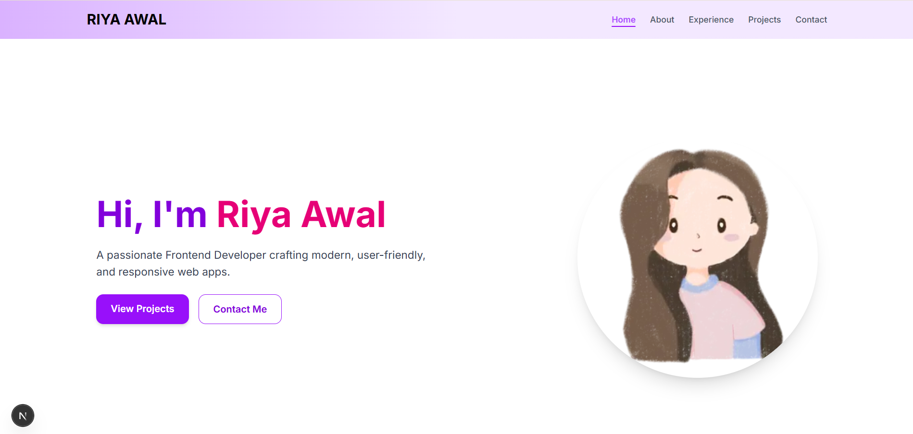

# 🌐 Personal Portfolio Website

A modern, responsive portfolio website showcasing my projects, skills, and professional experience as a web developer.



---

## ✨ Features

- ⚡ Fast and responsive design  
- 🎨 Clean UI with modern aesthetics  
- 🧩 Projects showcase with details  
- 📱 Fully responsive (mobile-first)  
- 🌙 Smooth animations and interactions  

---

## 🛠 Tech Stack

- **Framework:** Next.js / React  
- **Styling:** Tailwind CSS  
- **Language:** JavaScript / TypeScript  
- **Deployment:** Vercel / GitHub Pages  

---

## 📂 Project Structure

```bash
├── components/
├── pages/ (or app/)
├── public/
├── styles/
├── README.md
└── package.json
```
---

## 🚀 Get Started

Follow these steps to run the project locally on your machine:


### 1️⃣ Clone the repository

```bash
git clone https://github.com/username/repo-name.git
```

### 2️⃣ Navigate to the project folder
```bash
cd repo-name
```

### 3️⃣ Install dependencies
```bash
npm install
```

### 4️⃣ Start the development server
```bash
npm run dev
```

### 5️⃣ Open in Browser

Visit http://localhost:3000
 to see your portfolio live locally.